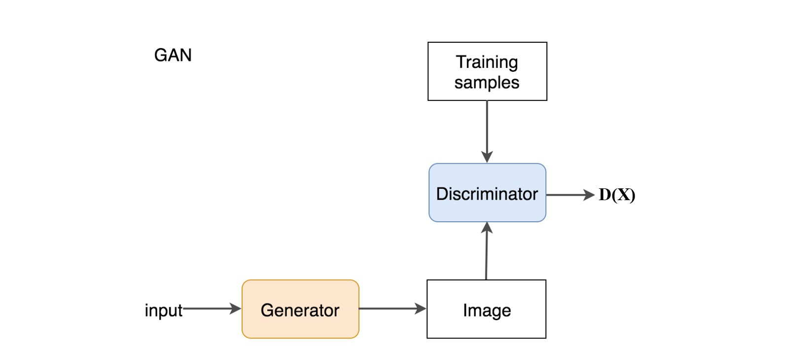
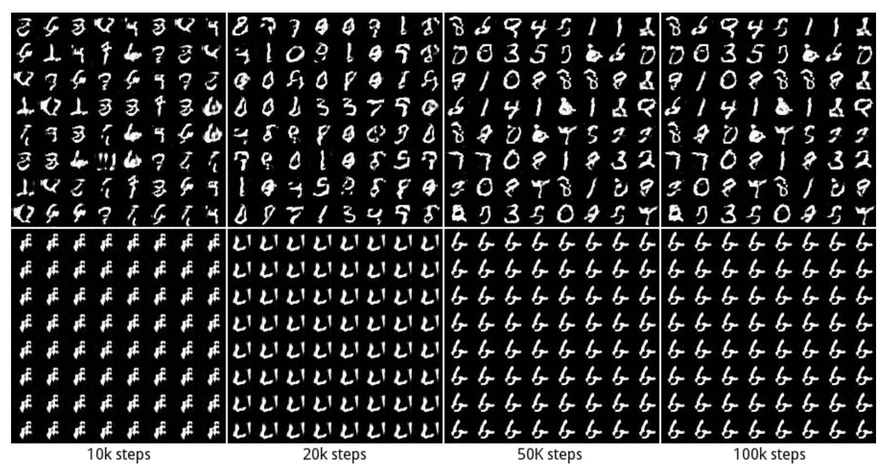

Generative Adversarial Networks are a type of artificial intelligence that can generate fake images that appear convincingly real. In 2014, Ian Goodfellow with help from a team of other computer scientists further developed the already existent neural network technology and coined the term General Adversarial Networks. GANs have two networks called a generator and discriminator. These engage in a zero-sum probability game: the generator produces an image, and the discriminator determines the probability that it looks like the real thing.

A random noise signal is fed to the generator, which it transposes into pixels through a series of probability vectors. This is done through a p(y|x) (probability of y given x) type of function. For instance, the probability of producing a cat given that this image contains ears, or p(cat|ears). The discriminator then takes this generated image of a cat and compares it to multitudes of real images of cats (also using probability functions and 4 convolution layers). After assessing the fake image from the generator, the discriminator signals that either the image is convincing or unconvincing. Some GANs use Bayesian statistical inference (which updates a probability formula as more data becomes available.) Using a Bayesian GAN prevents mode collapse and better image results from GANs. The bottom imnage shows data sets suffering from mode collapse, where a generator begins producing only one mode (number) instead of a variety of modes.

