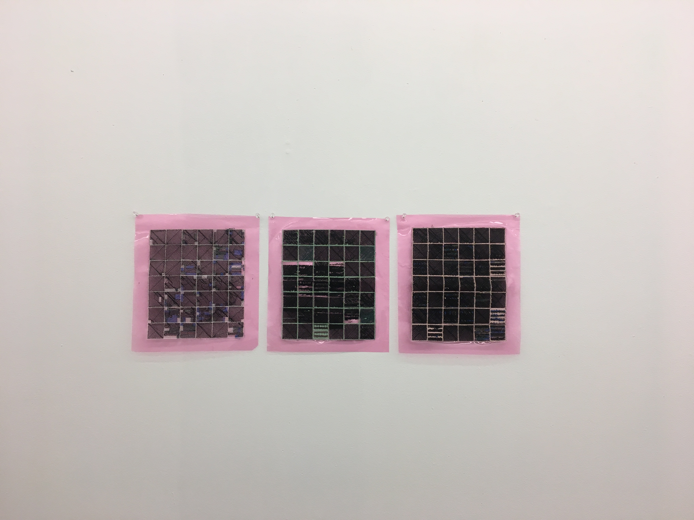

In 2014, Ian Goodfellow and a team of other computer scientists further coined the term General Adversarial Networks - a type of artificial intelligence that can identify and generate realistic images. The idea of adversarial networks was half-conceptualized in the 1960s, but due to lack of resources, wasn’t fully realized. Later on it was reinvented by Jurgen Schmidhuber in 1990. He came up with the idea of opposing neural networks, called Net 1 and Net 2. GANs work in a similar way - they have two networks called a generator and discriminator. These engage in a zero-sum probability game: the generator produces an image, and the discriminator determines the probability that it looks like the real thing.

A random noise signal is fed to the generator, which it transposes into pixels through a series of probability vectors. This is done through a p(y|x) (probability of y given x) type of function. For instance, the probability of producing a cat given that this image contains ears, or p(cat|ears). The discriminator then takes this generated image of a cat and compares it to multitudes of real images of cats (also using probability functions and 4 convolution layers). After assessing the fake image from the generator, the discriminator signals that either the image is convincing or unconvincing.

GANs have been used for a variety of purposes. A computer-generated painting called Edmond de Belamy sold for $432,000 in 2018, which has led to very interesting discourse on how the value of art is changing in the digital age. There is a scary possibility that GANs will put artists and designers out of work - GANs can now auto-generate video game characters, design graphics, and compose music. MidiNet is an example of a GAN that can generate melodies. They’ve even been used to style outfits, like with DiscoGAN, a adversarial network that can select clothes based on style, color, texture, and compatibility. However, GANs bring a myriad of other possibilities into the world, especially as they are a powerful tool for art-making.

