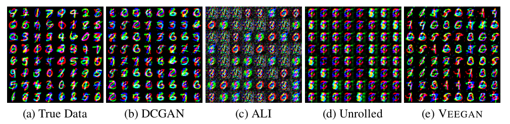

* Title: Datasets produced by various generative models
* Date: Published May 25th, 2017
* Dimensions: unknown

This is an image representing data sets used by generative adversarial networks. The caption reads, "Stacked MNIST dataset: a variant of the MNIST data is specifically designed to increase the number of discrete modes.The data is synthesized by stacking three randomly sampled MNIST digits along the color channel resulting in a 28x28x3 image." This is a super-jargony description that even I grapple with fully wrapping my head around, but essentially this means that the generator of this GAN is fed data samples in order to produce random data sets. I'm not quite sure what the "color channel" is but I think it has something to do with how the data is fed to the generator.
I chose this picture to inspire the imagery for my project, and because there is some interesting distortion happening in some of the generated numbers. This image comes from a scholarly article about a type of GAN, called VEEGAN, that prevents mode collapse. They never say in this paper what the data examples represent, but I know that similar data sets are used in generating images using GANs. Any generated image produced by a GAN is just a result of multiple probability functions, and it's interesting to see the actual numbers behind the resulting image.
